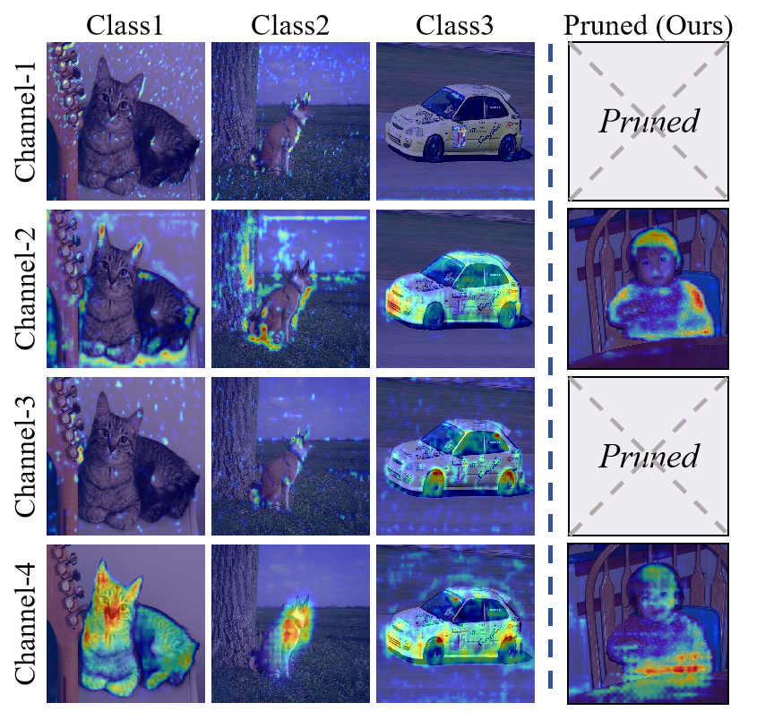

## FGP: Feature-Gradient-Prune for Efficient Convolutional Layer Pruning

Paper ID 18420

Paper: [https://github.com/FGP-code/FGP](https://github.com/FGP-code/FGP)

<div align="center">
<br>
	
</div>


## Abstract
> To reduce computational overhead while maintaining model performance, model pruning techniques have been proposed. Among these, structured pruning, which removes entire convolutional channels or layers, significantly improves computational efficiency and is compatible with hardware acceleration. However, existing pruning methods often struggle to accurately identify important channels, leading to the retention of redundant ones that negatively impact inference efficiency. To address this issue, this paper introduces a novel pruning method, Feature-Gradient Pruning (FGP). The proposed method combines both feature-based and gradient-based information to more effectively assess the importance of channels across all target classes, enabling a more precise identification of channels critical to model performance. Experimental results demonstrate that the proposed method improves model compactness and practical applicability while maintaining stable performance. Experiments across multiple tasks and datasets show that FGP significantly reduces computational costs and minimizes accuracy loss compared to existing methods, highlighting its effectiveness in optimizing pruning outcomes. 

## Motivation

<div align="center">
<br>
	
</div>


The visualization results show one channel from each of the four convolutional layers, along with heatmaps for three classes. FGP retains Channel-2 and 4, and pruned model keeps only those channels with strong support values across all classes.


## Preparations

#### 1. Download VOC 2012 dataset

```bash
wget http://host.robots.ox.ac.uk/pascal/VOC/voc2012/VOCtrainval_11-May-2012.tar
tar –xvf VOCtrainval_11-May-2012.tar
```

After downloading ` SegmentationClassAug.zip `, you should unzip it and move it to `data/VOCdevkit/VOC2012`. The directory structure should thus be

```
data
└── VOCdevkit
    └── VOC2012
        ├── Annotations
        ├── ImageSets
        ├── JPEGImages
            ├──Action
            ├──Layout
            ├──Main
            └──Segmentation
                ├──train.txt
                ├──val.txt
        ├── SegmentationClass
        └── SegmentationObject
```

We organized the VOC2012 dataset by individual categories. Each class's list of labels and image names are stored separately for training and testing of individual types in `FGP_datalist_20Class`.  

Put the contents of  `train_type_list.txt ` and  `val_type_list.txt ` for each category into  `train.txt ` and  `val.txt ` under ` ./data/VOCdevkit/VOC2012/JPEGImages/Segmentation ` when training the types. Image labels into  `./data/VOCdevkit/VOC2012/SegmentationClass `.

If you want to replace your training dataset, update the image name list in train.txt and val.txt and add the corresponding image labels within the SegmentationClass folders.


#### 2. Download pre-training weights 

* deeplabv3_resnet50: https://download.pytorch.org/models/deeplabv3_resnet50_coco-cd0a2569.pth

* deeplabv3_resnet101: https://download.pytorch.org/models/deeplabv3_resnet101_coco-586e9e4e.pth

  Rename the download weight to ```deeplabv3_resnet50_coco.pth```

  Rename the download weight to ```deeplabv3_resnet101_coco.pth```

  We use deeplabv3_resnet50 as an example in the code.

#### 3. Requirements

```
numpy
Pillow
torch>=1.7.1
torchvision>=0.8.2
ttach
tqdm
opencv-python
matplotlib
scikit-learn
grad-cam
```

### Process

Step1.  Run train.py 

Step2.  Run prune_test.py

Step3.  Run  predict.py


